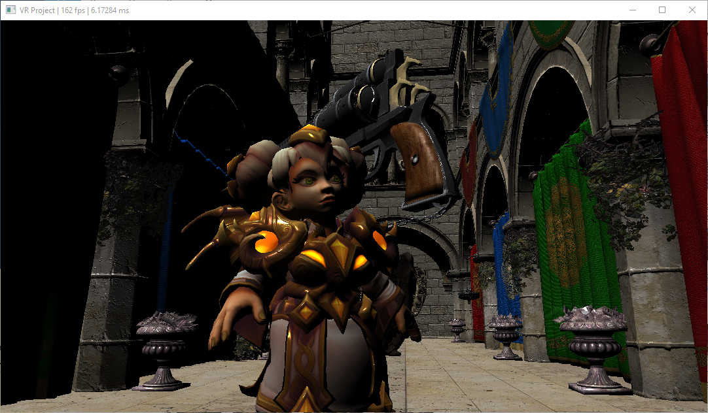
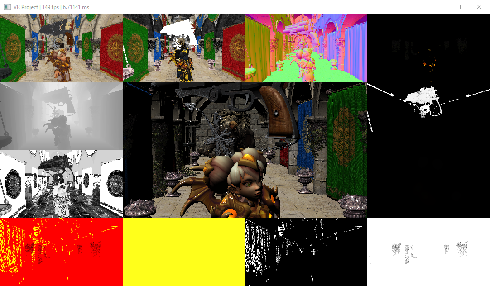
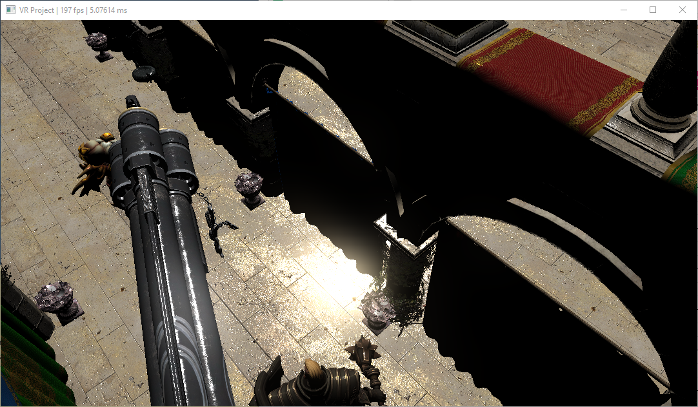
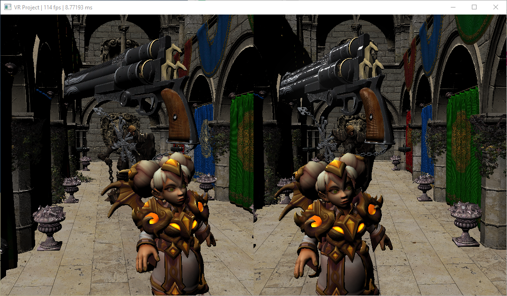
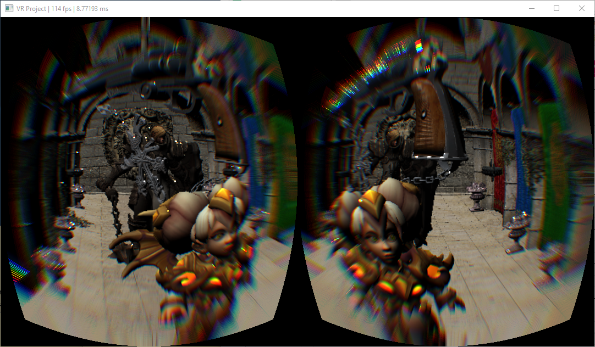

Vulkan VR Framework with Voxel Cone-tracing Global Illumination 
========================

**University of Pennsylvania, CIS 565: Vulkan Grass Rendering, Final Project**

* Byumjin Kim and Josh Lawrence 

### Overview

In this project, we are going to implement Vulkan VR framework with the contents of the paper, [Interactive indirect illumination using voxel cone tracing](http://citeseerx.ist.psu.edu/viewdoc/download?doi=10.1.1.225.5903&rep=rep1&type=pdf).

#### Deferred Rendering

#### HDR

#### VR mode

 
 
